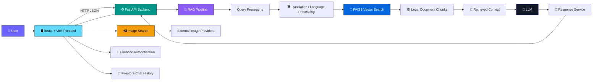

<div align="center">


<a href="#">
  
</a>


<br/><br/>


<br/><br/>

<a href="#-features"></a>
<a href="#-architecture"></a>
<a href="#-project-structure"></a>
<a href="#-getting-started"></a>

</div>

## 💡 Why This Exists

> Indian Intellectual Property laws contain large amounts of legal and statutory information that can be difficult to search, understand, and navigate.

**IP-Sakti-Sahayak** is an AI-powered legal information assistant designed to make Indian Intellectual Property and related legal documents easier to explore.

Instead of relying only on a general-purpose chatbot, the system uses **Retrieval-Augmented Generation (RAG)** to retrieve relevant sections from a curated collection of Indian Acts, Rules, and legal documents before generating an answer.

The project combines:

* 📚 Indian legal documents
* 🔎 Semantic vector search
* 🧠 Retrieval-Augmented Generation
* ⚖️ Source-grounded legal responses
* 🌐 Multilingual question support
* 🖼️ Relevant image retrieval
* 💬 Conversational chat interface
* 🔐 User authentication
* 📜 Chat history

The goal is simple:

> **Make Indian IP-related legal information easier to discover, understand, and interact with through an AI-powered interface.**

## ✨ Features

<table>
<tr>
<td width="50%" valign="top">

### ⚖️ Indian IP Legal Assistant

* Ask natural-language questions about Indian IP laws
* Retrieve information from statutory documents
* Answers are grounded in retrieved legal context
* Supports multiple legal domains
* Designed to reduce unsupported / hallucinated answers

### 📚 Legal Document RAG

* PDF-based legal document ingestion
* Text extraction and preprocessing
* Document chunking
* Metadata-aware retrieval
* FAISS vector index
* Context retrieval before answer generation

### 🔎 Semantic Search

* Converts legal documents into searchable vector representations
* Retrieves relevant chunks for a user query
* Helps locate specific sections and provisions
* Supports questions that do not exactly match the wording of the source document

</td>

<td width="50%" valign="top">

### 🌐 Multilingual Support

* Supports questions in multiple languages
* Automatic language detection / translation pipeline
* Designed for Hindi and English legal queries
* Example:

> पेटेंट क्या है और भारत में पेटेंट धारक को कौन से अधिकार प्राप्त होते हैं?

### 🖼️ Image Search

* Optional image retrieval for suitable queries
* Uses external image providers instead of storing large image collections locally
* Can return images alongside textual answers
* Designed for visual legal concepts such as Geographical Indications

### 💬 Modern Chat Interface

* React-based conversational UI
* Chat history
* Sidebar navigation
* Login/authentication
* Document upload interface
* Share functionality
* Responsive frontend

</td>
</tr>
</table>

### 🧪 Demonstration Capabilities

The system is designed to handle questions such as:

```text
What is a patent and what rights does a patent provide to the patent holder in India?

What are the conditions for obtaining a patent in India?

What information must be included in a patent application under the Patents Act, 1970?

What are the requirements for a complete specification under the Patents Act, 1970?

What acts constitute infringement of a patent in India?

What is the term of a patent in India and when does it begin?

Under what conditions can a compulsory licence be granted for a patent in India?

What are the rights of co-owners of a patent under the Patents Act, 1970?

पेटेंट क्या है और भारत में पेटेंट धारक को कौन से अधिकार प्राप्त होते हैं?
```

It is also designed to demonstrate **out-of-scope handling**, where the system should avoid presenting unrelated information as if it came from the legal corpus.

## 🏗 Architecture



### 🔄 RAG Flow

```text
User Question
      │
      ▼
React Frontend
      │
      ▼
FastAPI API
      │
      ▼
Query Processing
      │
      ├── Language Detection
      │
      └── Translation when required
      │
      ▼
FAISS Semantic Search
      │
      ▼
Relevant Legal Chunks
      │
      ▼
Context Construction
      │
      ▼
LLM Response Generation
      │
      ▼
Source-grounded Answer
      │
      ▼
React Chat Interface
```

For suitable queries, the image pipeline can independently retrieve relevant external images.

## 🛠 Tech Stack

<div align="center">

| Layer                 | Technology                      |
| :-------------------- | :------------------------------ |
| **Backend API**       | FastAPI · Python                |
| **RAG**               | Retrieval-Augmented Generation  |
| **Vector Search**     | FAISS                           |
| **Legal Documents**   | PDF-based Indian Acts & Rules   |
| **Frontend**          | React                           |
| **Build Tool**        | Vite                            |
| **Authentication**    | Firebase Authentication         |
| **Chat Storage**      | Firebase Firestore              |
| **Image Retrieval**   | External image APIs / providers |
| **Translation**       | Python translation pipeline     |
| **API Communication** | HTTP / JSON                     |

</div>

<br/>

## 📚 Legal Knowledge Base

The current dataset contains the following documents:

| Document                                    | Domain                   |
| :------------------------------------------ | :----------------------- |
| **Patents Act, 1970**                       | Patents                  |
| **Trade Marks Act, 1999**                   | Trademarks               |
| **Copyright Act, 1957**                     | Copyright                |
| **Designs Act, 2000**                       | Industrial Designs       |
| **Geographical Indications Act, 1999**      | Geographical Indications |
| **Biological Diversity Act, 2002**          | Biodiversity             |
| **Drugs and Cosmetics Act, 1940**           | Drugs & Cosmetics        |
| **Drugs and Cosmetics Rules, 1945**         | Drugs & Cosmetics        |
| **Traditional Medicine Strategy 2014–2023** | Traditional Medicine     |

The documents are processed into searchable chunks and stored in the FAISS index for semantic retrieval.

## 📂 Project Structure

<details>
<summary><b>Click to expand full directory tree</b></summary>

```text
ip-sakti-sahayak/
│
├── .env
├── .gitignore
├── .vscode/
│   └── extensions.json
│
├── README.md
│
├── backend/
│   ├── __init__.py
│   ├── build_index.py
│   ├── image_query.py
│   ├── image_router.py
│   ├── image_search.py
│   ├── ingest.py
│   ├── list_models.py
│   ├── main.py
│   ├── providers.py
│   ├── rag_chain.py
│   ├── response_service.py
│   └── translate.py
│
├── data/
│   ├── Drugs_and_Cosmetics_Act_1940.pdf
│   ├── Drugs_and_Cosmetics_Rules_1945.pdf
│   ├── Traditional_Medicine_Strategy_2014–2023.pdf
│   ├── biological_diversity_act_2002.pdf
│   ├── copyright_act_1957.pdf
│   ├── designs_act_2000.pdf
│   ├── gi_act_1999.pdf
│   ├── patents_act_1970.pdf
│   └── trademarks_act_1999.pdf
│
├── faiss_index/
│   └── index.faiss
│
├── ip-sakti-frontend/
│   ├── .firebaserc
│   ├── .gitignore
│   ├── README.md
│   │
│   ├── dist/
│   │   ├── assets/
│   │   │   ├── index-Dwfw6Yoy.css
│   │   │   └── index-F18FurRK.js
│   │   ├── index.html
│   │   └── logo.png
│   │
│   ├── eslint.config.js
│   ├── firebase.json
│   ├── firestore.indexes.json
│   ├── firestore.rules
│   ├── index.html
│   ├── package-lock.json
│   ├── package.json
│   │
│   ├── public/
│   │   └── logo.png
│   │
│   ├── src/
│   │   ├── App.css
│   │   ├── App.jsx
│   │   │
│   │   ├── api/
│   │   │   └── chatApi.js
│   │   │
│   │   ├── assets/
│   │   │   ├── hero.png
│   │   │   ├── react.svg
│   │   │   └── vite.svg
│   │   │
│   │   ├── components/
│   │   │   ├── ChatWindow.jsx
│   │   │   ├── DocumentUpload.jsx
│   │   │   ├── Login.jsx
│   │   │   ├── MessageList.jsx
│   │   │   └── Sidebar.jsx
│   │   │
│   │   ├── constants/
│   │   │   └── statutes.js
│   │   │
│   │   ├── firebase.js
│   │   ├── firestore.js
│   │   │
│   │   ├── hooks/
│   │   │   ├── useAuth.js
│   │   │   ├── useChat.js
│   │   │   └── useChatHistory.js
│   │   │
│   │   ├── index.css
│   │   ├── main.jsx
│   │   │
│   │   └── utils/
│   │       └── share.js
│   │
│   └── vite.config.js
│
├── package-lock.json
└── requirements.txt
```

</details>

> **Note:** `dist/`, `faiss_index/`, `.env`, and other generated/runtime files may be deployment or environment artifacts and should be handled appropriately when publishing the repository.

## 🚀 Getting Started

### Prerequisites


\

### 1️⃣ Clone the Repository

```bash
git clone <YOUR_REPOSITORY_URL>
cd ip-sakti-sahayak
```

### 2️⃣ Backend Setup

```bash
python -m venv venv

source venv/bin/activate
# Windows:
# venv\Scripts\activate

pip install -r requirements.txt
```

Configure your environment variables in `.env`.

### 3️⃣ Start the Backend

```bash
uvicorn backend.main:app --reload --port 8000
```

The API will be available at:

```text
http://127.0.0.1:8000
```

### 4️⃣ Start the Frontend

Open another terminal:

```bash
cd ip-sakti-frontend

npm install
npm run dev
```

Vite will provide the local frontend URL in the terminal.

### 5️⃣ Production Build

```bash
cd ip-sakti-frontend

npm run build
```

The production build is generated inside:

```text
ip-sakti-frontend/dist/
```

## 🔌 API Example

### Chat

```bash
curl -X POST http://127.0.0.1:8000/api/chat \
  -H "Content-Type: application/json" \
  -d '{"query":"What is the term of a patent in India and when does it begin?"}'
```

Example response structure:

```json
{
  "query": "What is the term of a patent in India and when does it begin?",
  "language": "en",
  "statute": "ALL",
  "answer": "Based on the retrieved statutory context...",
  "show_images": true,
  "search_query": "...",
  "images": []
}
```

The exact response depends on the retrieved legal context and configured providers.

## 🧠 RAG Pipeline

### Document Ingestion

```text
Indian Legal PDFs
       │
       ▼
PDF Extraction
       │
       ▼
Text Cleaning
       │
       ▼
Document Chunking
       │
       ▼
Metadata
       │
       ▼
Embeddings
       │
       ▼
FAISS Index
```

### Question Answering

```text
User Query
    │
    ▼
Language Processing
    │
    ▼
Query Embedding
    │
    ▼
FAISS Retrieval
    │
    ▼
Relevant Legal Chunks
    │
    ▼
LLM Context
    │
    ▼
Generated Answer
```

This architecture allows the model to answer using retrieved statutory material rather than relying exclusively on its pretrained knowledge.

## 🛡️ Legal Information Disclaimer

> **IP-Sakti-Sahayak is an educational and informational project.**
>
> The responses generated by this application are not a substitute for professional legal advice, legal representation, or consultation with a qualified legal practitioner.
>
> Always verify important legal information against the latest official legislation, rules, notifications, and authoritative government sources.

## 🤝 Contributing

Contributions, suggestions, and feature requests are welcome.

```bash
# Fork the repository

# Create a feature branch
git checkout -b feature/my-feature

# Commit
git add .
git commit -m "Add my feature"

# Push
git push origin feature/my-feature

# Open a Pull Request
```

<br/>

## 📄 License

This project is currently intended as an educational / hackathon project.

Add an appropriate license to the repository before distributing the project publicly.

<br/>

<div align="center">

## ⭐ Support

If you find **IP-Sakti-Sahayak** useful or interesting, consider giving the project a ⭐ on GitHub.

<br/>

> ⚖️ **Making Indian legal information easier to explore with AI.**

<br/>


</div>
